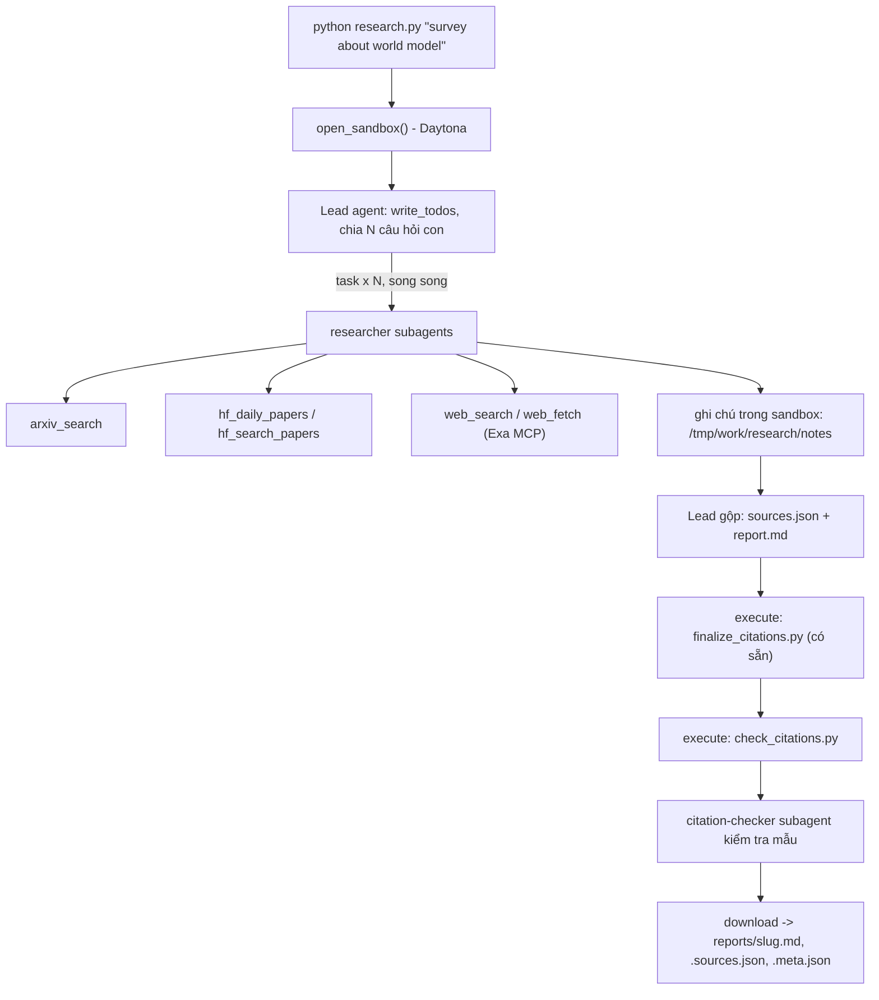

# Deep Research Agent - bài nộp

Pham Ho Quang Dung - 2A202602860 - Lab Day 23 (Deep Agents + Sandbox).

Hệ thống nhận một chủ đề, lead agent lập kế hoạch và giao các câu hỏi con cho nhiều `researcher` chạy song song
(arXiv, Hugging Face, web qua Exa), gộp ghi chú thành `sources.json`, viết báo cáo, rồi chạy script hoàn thiện
trích dẫn và validator **bên trong sandbox Docker** cho tới khi validator in `OK`. Đề bài gốc nằm ở cuối tệp này.

## Kết quả: 5 báo cáo trong `reports/`

| Chủ đề | Báo cáo | Thời gian | `subagent_calls` | Nguồn | Họ nguồn |
|---|---|---|---|---|---|
| survey about world model | [md](reports/survey-about-world-model.md) | 6.8 phút | 6 | 32 | arxiv, hf-search, web |
| survey about reinforcement learning for LLM reasoning | [md](reports/survey-about-reinforcement-learning-for-llm-reasoning.md) | 8.1 phút | 8 | 30 | arxiv, hf-daily, hf-search, web |
| survey about LLM agents and tool use | [md](reports/survey-about-llm-agents-and-tool-use.md) | 17.1 phút | 7 | 43 | arxiv, hf-daily, hf-search, web |
| survey about video and multimodal generation | [md](reports/survey-about-video-and-multimodal-generation.md) | 12.0 phút | 7 | 22 | arxiv, hf-search, web |
| survey about efficient inference and small language models | [md](reports/survey-about-efficient-inference-and-small-language-models.md) | 10.2 phút | 9 | 23 | arxiv, hf-daily, hf-search, web |

Cả 5 báo cáo: validator in `OK` trong sandbox, `subagent_calls >= 3`, ít nhất 3 họ nguồn, và lead đã gọi
`citation-checker` để kiểm tra mẫu trước khi kết thúc.

`python self_check.py` in `READY to submit`. Mô hình: `openai:gpt-5.4-mini`, sandbox: Docker (`python:3.12-slim`, không mạng).

## Cài đặt

Python 3.11+ và Docker Desktop (hoặc tài khoản Daytona).

```bash
python -m venv .venv
.venv\Scripts\Activate.ps1          # Windows PowerShell;  Linux/macOS: source .venv/bin/activate
pip install -r requirements.txt
cp .env.example .env                 # rồi điền khóa của bạn; KHÔNG commit .env
```

Trong `.env`: `LAB_MODEL=openai:gpt-5.4-mini` + `OPENAI_API_KEY`, `EXA_API_KEY`, và `SANDBOX=docker`
(hoặc `DAYTONA_API_KEY` để dùng Daytona). Mô hình phải hỗ trợ tool calling.

## Chạy

```bash
python research.py "survey about world model"     # một chủ đề: ~7-17 phút, ghi 3 tệp vào reports/
python tools.py                                     # thử riêng 5 công cụ nguồn dữ liệu (gọi mạng thật)
python -m unittest                                  # 47 test offline (không mạng, không LLM)
python self_check.py                                # kiểm tra trước khi nộp (không tốn token)
python check_citations.py reports/<slug>.md reports/<slug>.sources.json
```

Trong lúc chạy, `research.py` in từng lời gọi công cụ của lead (`[lead] task researcher: ...`,
`[lead] execute python3 .../check_citations.py`) và in `WARNING:` khi báo cáo có rủi ro về điểm (ít hơn 3 lần uỷ quyền,
ít hơn 3 họ nguồn, lỗi trích dẫn, hoặc URL không do công cụ nào trả về). Chạy hỏng thì thoát mã 1 và không ghi gì.

## Đọc thư mục `reports/`

Mỗi chủ đề có ba tệp cùng tên `<slug>` (ví dụ `survey-about-world-model`):

| Tệp | Nội dung |
|---|---|
| `<slug>.md` | Báo cáo: TL;DR, Background, 3-6 phần theo chủ đề, Trends and open problems, `## References`. Mỗi `[n]` trỏ tới dòng `[n]` trong References. |
| `<slug>.sources.json` | Mảng `{n, id, url, title, date, source}`; `source` là công cụ đã tìm ra nguồn: `arxiv`, `hf-daily`, `hf-search` hoặc `web`. |
| `<slug>.meta.json` | Bằng chứng chạy: `subagent_calls` (số lần lead gọi `task`), `tool_calls`, `source_families`, `n_sources`, `elapsed_s`, `tokens` (chỉ của lead, chưa gồm subagent). |

Hai tệp đầu là **đúng bản tải về từ sandbox** (ghi theo byte), không sửa tay.

## Thiết kế

| Tệp | Vai trò |
|---|---|
| `tools.py` | `with_retry` (backoff lũy thừa + jitter, tôn trọng `Retry-After`, chặn bởi `cap`) và 5 công cụ chạy ở host: `arxiv_search`, `hf_daily_papers`, `hf_search_papers`, `web_search`, `web_fetch`. Không bao giờ ném ngoại lệ: trả JSON, `NO RESULTS` hoặc `ERROR: ...`. |
| `agents.py` | Prompt và cấu hình: lead (`write_todos`, file tools, `execute`, `task`, **không** có công cụ tìm kiếm nên buộc phải uỷ quyền), `researcher` (5 công cụ nguồn), `citation-checker` (chỉ `web_fetch`). |
| `research.py` | Vòng đời: mở sandbox, tải lên validator + finalizer, chạy lead, tải báo cáo về, ghi `meta.json`. |
| `check_citations.py` | Validator chạy trong sandbox, chỉ dùng thư viện chuẩn: 6 quy tắc của GUIDE phần 4, cộng kiểm tra họ nguồn khớp URL. |

Các quyết định đáng chú ý:

- **Giới hạn chi phí (GUIDE 2.5):** lead 120 lần gọi mô hình / 250 lần gọi công cụ, mỗi researcher 40/60, checker 15/20
  (`ModelCallLimitMiddleware`, `ToolCallLimitMiddleware`), `recursion_limit=1000`. deepagents tự thêm một subagent
  `general-purpose` có toàn bộ công cụ của lead và **không** có giới hạn; hệ thống tắt nó để lead chỉ có hai subagent đã giới hạn.
- **Bí mật:** khóa chỉ ở host; sandbox không mạng và chỉ nhận hai script. Khóa Exa gửi qua header
  `Authorization: Bearer` (Exa hỗ trợ) thay vì `?exaApiKey=` để không bao giờ lọt vào thông báo lỗi của `httpx`; mọi
  chuỗi `ERROR` vẫn được che khóa.
- **Giới hạn tốc độ:** arXiv giãn cách 3 giây có khóa luồng (các researcher chạy song song); Exa được phát hiện cả
  khi trả HTTP 429, lỗi JSON-RPC, hay HTTP 200 kèm cờ trong `result._meta`. `Retry-After` quá 15 phút (quota theo
  ngày) thì bỏ cuộc ngay để agent chuyển nguồn khác.
- **Chống URL bịa:** mỗi công cụ ghi lại các URL nó thật sự trả về; `research.py` cảnh báo nếu `sources.json` có URL
  không nằm trong tập đó. Validator kiểm họ nguồn khớp URL (`arxiv` = `https://arxiv.org/abs/<id>`,
  `hf-*` = `https://huggingface.co/papers/<id>`), prompt bắt đổi **họ** chứ không bao giờ sửa **URL**.

## Kiểm tra mẫu trích dẫn

Ngoài các bước tự động, mình kiểm tra thủ công trước khi nộp:

- **Mọi URL** của 5 báo cáo (150 nguồn) được mở lại: tất cả trả 200, trừ vài trang chặn bot (`dl.acm.org`,
  `openai.com` trả 403) nhưng có thật.
- **15 câu trích dẫn** (3 câu/báo cáo, ưu tiên câu có số liệu) được đối chiếu với nguồn: 8 được nguồn xác nhận
  (ví dụ DistilBERT "40% nhỏ hơn, giữ 97%, nhanh hơn 60%"; SWE-agent được đánh giá trên SWE-bench và
  HumanEvalFix), 7 được xác nhận một phần
  (câu tổng hợp rộng, nhiều trích dẫn), 0 sai hay bịa.
- Lần kiểm tra đầu từng phát hiện hai URL hỏng (một URL Hugging Face dựng từ mã ACL Anthology, một URL ICLR thiếu
  một đoạn đường dẫn). Hai chủ đề đó được **chạy lại** sau khi thêm cơ chế truy vết URL và siết prompt (không sửa tay
  báo cáo); bản cuối không còn URL hỏng.

## Hạn chế đã biết

- `tokens` trong `meta.json` chỉ đếm lead; chi phí thật (gồm researcher) cao hơn nhiều.
- Thời gian chạy dao động (7-17 phút) theo số lần lead giao lại việc và độ rộng của chủ đề.
- Một số câu tổng hợp chỉ được nguồn ủng hộ một phần (nguồn nói ý chính, câu báo cáo diễn giải rộng hơn).

---

# Đề bài gốc

Lab dựng một **hệ thống deep research đa tác tử**: người dùng chỉ cần nhập một chủ đề (ví dụ `survey about world model`), hệ thống tự lập kế hoạch, giao việc cho nhiều subagent, tìm tài liệu trên arXiv, Hugging Face và web, rồi viết một **báo cáo có trích dẫn**.

Hình thức: **bài thực hành cá nhân**. Ngôn ngữ lập trình: Python 3.11 trở lên.

### 1. Mục tiêu học tập

Sau lab, bạn có thể:

1. Dựng agent bằng thư viện Deep Agents (LangChain): công cụ (tool), system prompt, subagent, backend.
2. Dùng **sandbox** (Daytona) làm không gian làm việc và nơi chạy mã cho agent; hiểu vì sao khóa API và công cụ mạng phải nằm ở phía host chứ không nằm trong sandbox.
3. Viết công cụ gọi API ngoài **chịu được giới hạn tốc độ** (retry, backoff, jitter, `Retry-After`).
4. Thiết kế quy trình đa tác tử: lead chia nhỏ câu hỏi, giao cho N researcher chạy song song, tổng hợp và kiểm tra trích dẫn.
5. Tạo báo cáo có thể kiểm chứng: mọi khẳng định có `[n]` trỏ tới một nguồn có thật.

### 2. Hệ thống làm gì



Nguồn dữ liệu:

| Nguồn | Dùng để |
|---|---|
| arXiv API `https://export.arxiv.org/api/query` | Tìm bài theo từ khóa, sắp theo ngày |
| Hugging Face Daily Papers `/api/daily_papers` | Bài đang "trending": upvotes, githubRepo, summary |
| Hugging Face papers search `/api/papers/search?q=` | Tìm bài theo chủ đề |
| Web qua Exa MCP (`web_search_exa`, `web_fetch_exa`) | Blog, survey, trang dự án, nội dung đầy đủ của một URL |

### 3. Cấu trúc thư mục

```
Lab/
├── README.md  GUIDE.md  RUBRIC.md  REPORT_TEMPLATE.md   tài liệu
├── topics.md                 5 chủ đề cần chạy
├── requirements.txt  .env.example  .gitignore
├── model.py                  CÓ SẴN - không sửa: tạo mô hình LLM từ biến môi trường
├── sandbox.py                CÓ SẴN - không sửa: sandbox Daytona (hoặc Docker), upload, download
├── self_check.py             CÓ SẴN - không sửa: tự kiểm tra trước khi nộp (python self_check.py)
├── finalize_citations.py     CÓ SẴN - không sửa: script chạy trong sandbox, tự sinh `## References` và đánh số lại trích dẫn
├── tools.py                  SINH VIÊN CÀI ĐẶT: retry + 5 công cụ nguồn dữ liệu
├── agents.py                 SINH VIÊN CÀI ĐẶT: prompt, subagent, lead agent
├── research.py               SINH VIÊN CÀI ĐẶT: script chính
├── check_citations.py        SINH VIÊN CÀI ĐẶT: kiểm tra trích dẫn, chạy TRONG sandbox
└── reports/                  báo cáo sinh ra (bạn commit vào repo nộp)
```

Mỗi tệp "SINH VIÊN CÀI ĐẶT" là **pseudo-code chạy được** (import được): các hàm có docstring mô tả việc cần làm, các `TODO n` đánh số theo `GUIDE.md`, thân hàm đang `raise NotImplementedError`.

### 4. Cài đặt

```bash
python3 -m venv .venv && source .venv/bin/activate      # Python 3.11+
pip install -r requirements.txt
cp .env.example .env                                     # rồi điền khóa CỦA BẠN
```

Bạn cần ba loại khóa (điền vào `.env`, **không bao giờ commit** `.env`):

| Khóa | Lấy ở đâu | Ghi chú |
|---|---|---|
| LLM (`LAB_MODEL` + khóa nhà cung cấp) | Nhà cung cấp bạn chọn (OpenAI, Anthropic, Google, OpenRouter, Ollama...) | Mô hình **phải hỗ trợ tool calling**. Chép tên mô hình từ tài liệu của nhà cung cấp. |
| `DAYTONA_API_KEY` | https://app.daytona.io | Kiểm tra gói miễn phí / credit hiện hành. Không có tài khoản hoặc hết credit: đặt `SANDBOX=docker` để chạy sandbox trong container Docker cục bộ (xem `.env.example`). |
| `EXA_API_KEY` (khuyến nghị) | https://dashboard.exa.ai/api-keys | Có thể chạy không khóa, nhưng bản miễn phí của MCP bị giới hạn tốc độ rất nhanh. |

### 5. Làm bài

Làm theo thứ tự (chi tiết trong `GUIDE.md`):

1. `check_citations.py`: khởi động nhẹ, thuần Python.
2. `tools.py`: viết `with_retry` và 5 công cụ. Thử riêng từng công cụ: `python tools.py`.
3. `agents.py`: viết prompt, subagent và lead agent.
4. `research.py`: ghép tất cả; chạy một chủ đề:

```bash
python research.py "survey about world model"
```

Kết quả nằm ở `reports/survey-about-world-model.md` cùng `.sources.json` và `.meta.json`.

### 6. Chủ đề và nộp bài

- Chạy đủ **5 chủ đề** trong [`topics.md`](topics.md), mỗi chủ đề một lần.
- Commit mã nguồn và toàn bộ `reports/`, đẩy lên một **public repo** GitHub và nộp link.
- Kiểm tra trước khi nộp: chạy **`python self_check.py`** (không tốn token): nó kiểm tra đủ 5 báo cáo, `meta.json`, trích dẫn bằng `check_citations.py` của bạn, và không có `.env`/khóa nào trong git.
- Cách chấm: xem [`RUBRIC.md`](RUBRIC.md).

### 7. Thời gian, chi phí và an toàn

- Dùng một mô hình **rẻ nhưng hỗ trợ tool calling**, và **đặt giới hạn** (số lần gọi mô hình/công cụ cho lead và subagent, `recursion_limit`): một prompt hỏng có thể khiến agent lặp rất lâu. Đây là hạng mục 2.5 của `RUBRIC.md`.
- Kết quả có tính ngẫu nhiên: cùng một mã có thể cho báo cáo hợp lệ ở lần này và trích dẫn lỗi ở lần sau. Hãy sửa **prompt và mã**, không sửa tay báo cáo.

- Mỗi lần chạy tốn token LLM và thời gian sandbox. `tokens` trong `meta.json` chỉ đếm tin nhắn của lead, chưa gồm subagent, nên chi phí thật cao hơn. `open_sandbox()` luôn dừng và xóa sandbox khi kết thúc, kể cả khi lỗi. Đừng bỏ qua nó.
- **Không đưa bí mật vào sandbox.** Sandbox không ngăn được prompt injection hay việc đẩy dữ liệu ra mạng; một trang web độc hại có thể khiến agent chạy lệnh bên trong sandbox. Vì vậy mọi công cụ gọi mạng và mọi khóa ở lại phía host.
- Nội dung lấy từ web là **dữ liệu không đáng tin**: agent không được làm theo chỉ dẫn nằm trong đó.
